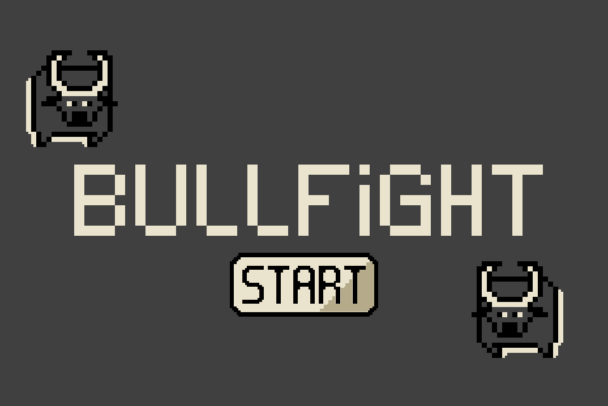
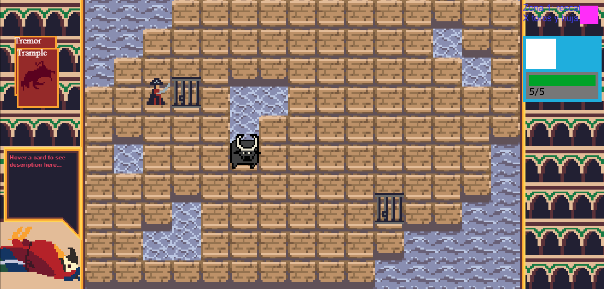
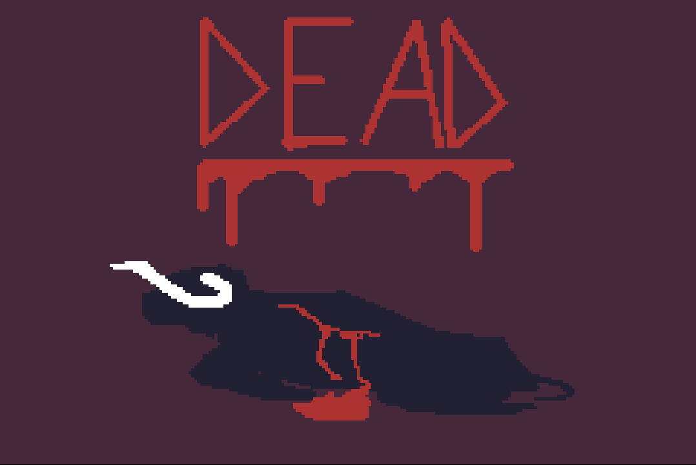

# BULLFIGHT
## Un juego de `undefined`
Este proyecto es un trabajo universitario para la asignatura de PVLI, impartida en el Grado en Desarrollo de Videojuegos de la Universidad Complutense de Madrid.

Bullfight es un juego de combate estratégico por turnos, donde encarnas a un toro que desea ser libre. 

Para ello deberás derrotar a todos los enemigos que se interpongan en tu camino, así como ir liberando a otros toros que se convertirán en tus aliados.

Bullfight no es un juego de turnos convencional: la sensación de juego es más parecida a la de un juego a tiempo real debido a la fluidez de los turnos, pero los enemigos tan sólo actuarán mientras tú estés actuando. Es decir, si tú te mueves, el enemigo también hará algo; si en cambio tú estás quieto, entonces se quedarán congelados esperando a que realices alguna acción.

### Capturas del juego

### Hora de jugar
[Esta es la web](https://andrea-aparicio-lopez.github.io/PVLI-Grupo01/) donde podrás jugar a BULLFIGHT. El juego se encuentra aún en desarrollo.

### Redes
Tenemos una cuenta de [Instagram](https://www.instagram.com/undefined_pvli/), donde podrás seguir nuestro progreso a medida que vamos desarrollando.

### Arquitectura
Enlace a la [arquitectura](https://www.figma.com/board/7GMuZDRarw7no5p5UoJq9A/Bullfight-remasterizado?node-id=0-1&t=4C0x3SrfVCsVVHtS-1)

### Assets
Sistema de Pathfinding: propiedad de easyStar.
Botón de inicio del Main Menu: propiedad de Toni.

Todos los assets empleados han sido creados por y son propiedad de `undefined`.
* Sprites y UI por: Hugo de Brito, Andrea Aparicio, Guillermo Sánchez
* Música por: Guillermo Sánchez

### Créditos
Juego creado por Hugo de Brito, Andrea Aparicio y Guillermo Sánchez
