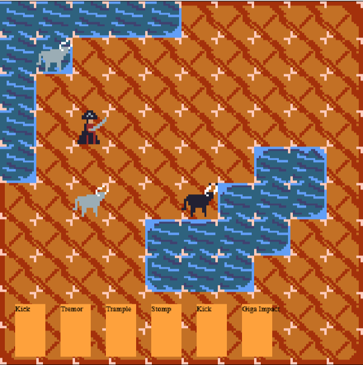

# PVLI - Grupo 1
Este proyecto es un trabajo universitario del Grado de Desarrollo de Videojuegos de la Universidad Complutense de Madrid.
## Índice

- [[Arquitectura de clases]]

### Descripción
En Bullfight, tomas el control de un grupo de toros que busca librarse del temido final que les espera. Múltiples enemigos se cruzarán en tu camino, intentando reconducirte a la plaza de toros. !Deberás valerte de tus mejores estrategias para aprovechar al máximo las habilidades taurinas y lograr así derrotar a los enemigos!

### Enlace a la pagina web
https://andrea-aparicio-lopez.github.io/PVLI-Grupo01/

### Capturas
